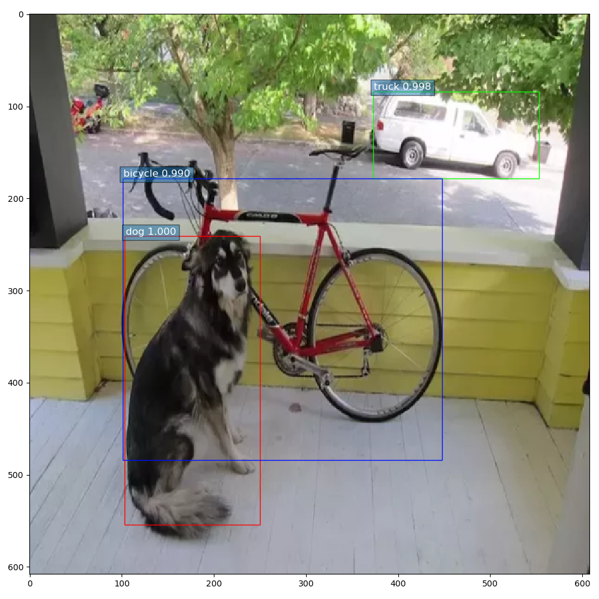
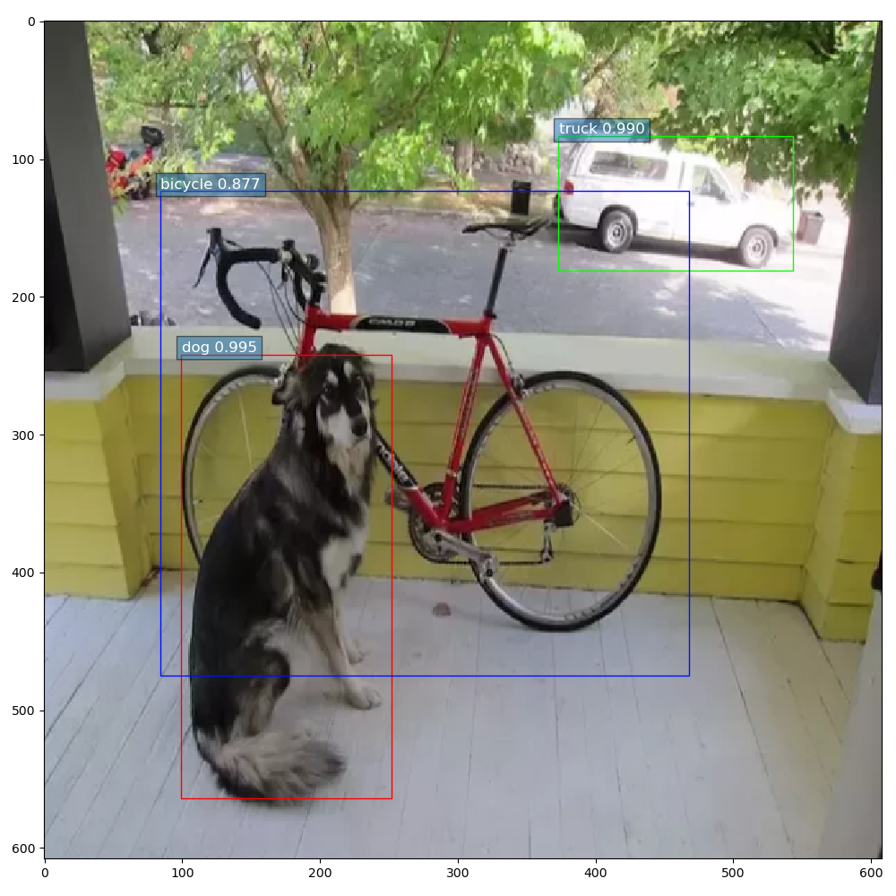

# darknet-to-pytorch
Easily convert Darknet weights with cfgs to PyTorch!

Currently only support `yolov3`, `yolov3-spp`, and `yolov3-tiny`,
since I don't think anyone would use `Darknet` to implement `RNNs`.

This repo is in active development. Issues are welcome.

# Contribute
Currently, I don't know how `Darknet C++ version` pads the feature map to
keep the size after max-pooling when `stride = 1`.

Thus, loading official weights of `yolov3-spp` and `yolov3-tiny` may cause problem.

If you do know a bit, feel free to open an issue and tell me. Thank you.

# Getting the weights and cfgs
```
cd src
bash get_weights.sh
```

# Simple Guide
See `main.py`

```
    net = get_net('yolov3-spp')  # Currently support yolov3 / yolov3-spp / yolov3-tiny
    net.summary() # will print the network layers summary

    size = int(net.net_info['height'])
    img, x = load_test_img('./src/dog-cycle-car.png', size)  # Load the test image

    raw_preds = net(x).detach()  # Raw preds

    preds = net.get_results(raw_preds, num_classes=80, conf_thres=0.5, nms_thres=0.4)  # Transform to bboxes
    print(preds)

    print_preds(preds, img)  # simple vis
```

# DEMO
`conf_threshold` is set to `0.5`.

## YOLOv3


## YOLOv3-SPP


## YOLOv3-Tiny


# Credits
- https://blog.paperspace.com/tag/series-yolo/
- https://pjreddie.com/darknet/yolo/
